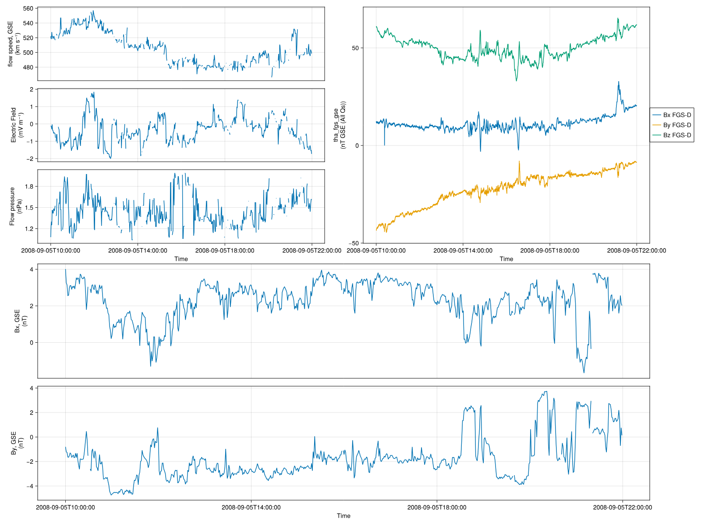

### Software Development

**Context**: A central requirement for this thesis is the ability to perform high-performance, interactive, and reproducible analysis of space plasma data and particle dynamics. While the established SPEDAS framework—originally developed in IDL and later ported to Python—remains widely used in the community, its design limitations hinder modern scientific workflows (big data, parallel/distributed computing, etc.).

**Approach**: To address this, we developed a suite of Julia-based software tools that combine the flexibility and speed of a modern language with the functionality of legacy systems.

**Results**: The core of this framework is `SPEDAS.jl`, which has interfaces directly with [`pyspedas`](https://github.com/spedas/pyspedas), [`speasy`](https://github.com/SciQLop/speasy), and [`HAPI`](https://hapi-server.org/) while introducing new routines with significantly improved performance. To enable efficient test-particle tracing in both analytic presets and numerical derived electromagnetic fields, we developed `TestParticle.jl`, a lightweight tool for rapid particle trajectory simulations. Additionally, we created [`SpaceDataModel.jl`](https://github.com/beforerr/SpaceDataModel.jl) to implement flexible, standards-compliant data structures aligned with SPASE and HAPI specifications, and contributed physics utilities through [`ChargedParticles.jl`](https://github.com/JuliaPlasma/ChargedParticles.jl) and [`PlasmaFormulary.jl`](https://github.com/JuliaPlasma/PlasmaFormulary.jl). These tools have been integral to the data analysis (e.g., @fig-sp), modeling, and simulation components of this thesis, enabling scalable and transparent research workflows essential for studying particle transport in the heliosphere.

```julia
f = Figure()
tvars1 = ["cda/OMNI_HRO_1MIN/flow_speed", "cda/OMNI_HRO_1MIN/E", "cda/OMNI_HRO_1MIN/Pressure"]
tvars2 = ["cda/THA_L2_FGM/tha_fgs_gse"]
tvars3 = ["cda/OMNI_HRO_1MIN/BX_GSE", "cda/OMNI_HRO_1MIN/BY_GSE"]
t0,t1 = "2008-09-05T10:00:00", "2008-09-05T22:00:00"
tplot(f[1, 1], tvars1, t0, t1)
tplot(f[1, 2], tvars2, t0, t1)
tplot(f[2, 1:2], tvars3, t0, t1)
f
```

{#fig-sp}

