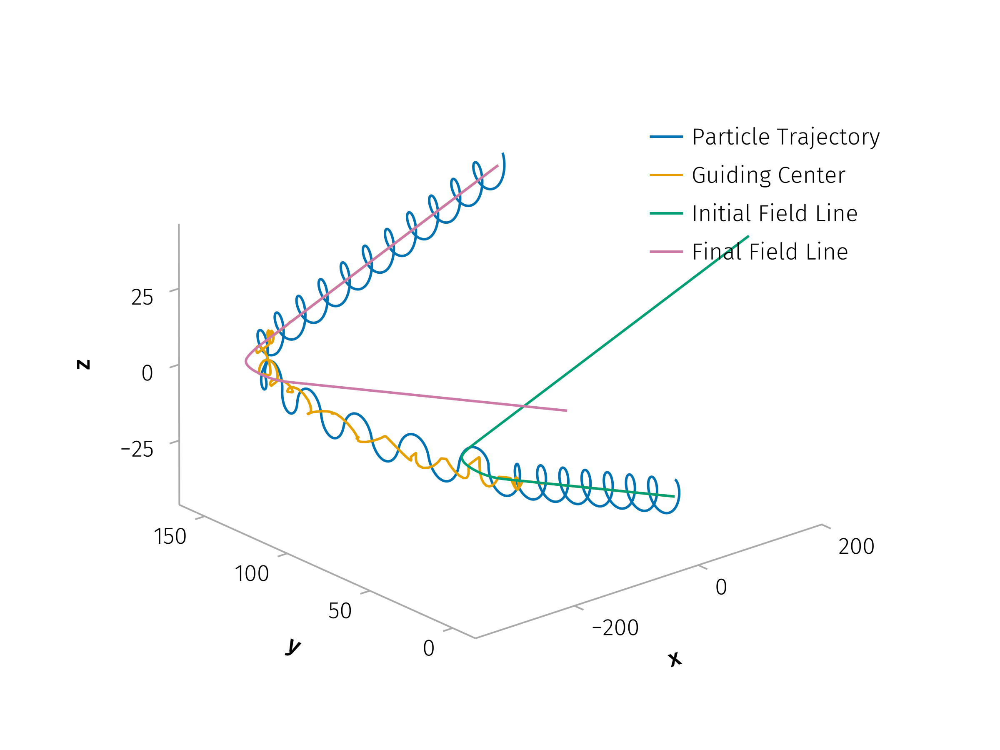

Building on previous results, the next phase of research will extend the pitch-angle scattering framework to comprehensively model spatial diffusion processes (both parallel and perpendicular). This extension is crucial for accurately capturing the full scope of SEP transport influenced by current sheets.

The key parameters—$v_{\parallel,1}$, $T_{cs}$, $\Delta s_\perp$, and $\Delta t$—are directly extracted from test-particle simulations, while quantities such as the current sheet separation distance $s_{fs}$, thickness, shear angle, and normal orientation are treated as system parameters derived from solar wind observations. Together, these inputs enable a systematic and physically grounded estimation of spatial diffusion coefficients under realistic heliospheric conditions.

{#fig-dR-perp width=70%}

To ensure consistency with heliospheric observations, we use realistic solar wind current sheet parameters to derive the diffusion coefficients using multiple spacecraft spanning radial distances from 0.1 to 5 AU. The derived diffusion coefficients will then be incorporated into turbulence-based transport models, providing a current-sheet-informed extension to global energetic particle transport frameworks.